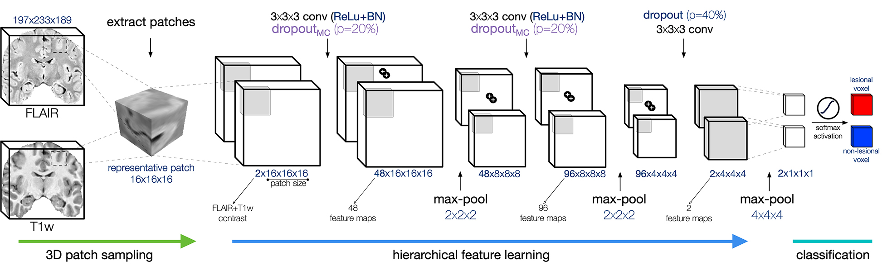

cut the crap, this code "works" with bids data and outputs bidsdata (somewhat)

***run***

python app/inference_bids.py -bp <bids directory> -sp <space> -dev cuda -pp -bm

***install***

conda env create -f environment.yml

conda activate deepfcd

pip install -r app/deepMask/app/requirements.txt

pip install -r app/requirements.txt


<h2 align="center">
  Code repository for:<br>
  Multicenter Validated Detection of Focal Cortical Dysplasia using Deep Learning<br>
</h2>

<p align="center">
      <a href="https://www.python.org/">
        </a>
      <a href= "https://keras.io/">
        </a>
      <a href= "https://github.com/Theano/Theano">
        </a>
      <a href= "https://github.com/NOEL-MNI/deepFCD/blob/main/LICENSE">
        </a>
      <a href="https://doi.org/10.1212/WNL.0000000000012698">
        </a>
      <a href="https://doi.org/10.5281/zenodo.4521706">
        </a>
</p>

------------------------



### Please cite:
> Gill, R. S., Lee, H. M., Caldairou, B., Hong, S. J., Barba, C., Deleo, F., D'Incerti, L., Mendes Coelho, V. C., Lenge, M., Semmelroch, M., Schrader, D. V., Bartolomei, F., Guye, M., Schulze-Bonhage, A., Urbach, H., Cho, K. H., Cendes, F., Guerrini, R., Jackson, G., Hogan, R. E., … Bernasconi, A. (2021). Multicenter Validation of a Deep Learning Detection Algorithm for Focal Cortical Dysplasia. Neurology, 97(16), e1571–e1582. https://doi.org/10.1212/WNL.0000000000012698

OR

```TeX
@article{GillFCD2021,
  title = {Multicenter Validated Detection of Focal Cortical Dysplasia using Deep Learning},
  author = {Gill, Ravnoor Singh and Lee, Hyo-Min and Caldairou, Benoit and Hong, Seok-Jun and Barba, Carmen and Deleo, Francesco and D'Incerti, Ludovico and Coelho, Vanessa Cristina Mendes and Lenge, Matteo and Semmelroch, Mira and others},
  journal = {Neurology},
  year = {2021},
  publisher = {American Academy of Neurology},
  code = {\url{https://github.com/NOEL-MNI/deepFCD}},
  doi = {https://doi.org/10.1212/WNL.0000000000012698}
}
```

## Pre-requisites
```bash
0. Anaconda Python Environment
1. Python == 3.7.x
2. Keras == 2.2.4
3. Theano == 1.0.4
4. ANTsPy == 0.3.5 (for MRI preprocessing)
4. ANTsPyNet == 0.2.0 (for deepMask)
5. PyTorch == 1.11.0 (for deepMask)
6. h5py == 2.10.0
+ app/requirements.txt
+ app/deepMask/app/requirements.txt
```

## Installation

```bash
# clone the repo with the deepMask submodule
git clone --recurse-submodules -j2 https://github.com/NOEL-MNI/deepFCD.git
cd deepFCD

# install Miniconda3
wget https://repo.anaconda.com/miniconda/Miniconda3-latest-Linux-x86_64.sh -O ~/miniconda.sh
bash ~/miniconda.sh -b -p $HOME/miniconda

# create and activate a Conda environment for preprocessing
conda create -n preprocess python=3.7
conda activate preprocess
# install dependencies using pip
python -m pip install -r app/deepMask/app/requirements.txt
conda deactivate

# create and activate a Conda environment for deepFCD
conda create -n deepFCD python=3.7
conda activate deepFCD
# install dependencies using pip
python -m pip install -r app/requirements.txt
conda install -c conda-forge pygpu=0.7.6

```


## Usage

### 1. Directory Organization
The assumed organization of the directories is specified below:
```bash
${IO_DIRECTORY}
└── ${PATIENT_ID}/              # [this patient-specific directory is contained within ${IO_DIRECTORY}]
    ├── noel_deepFCD_dropoutMC  # [deepFCD output images]
    │   ├── ${PATIENT_ID}_noel_deepFCD_dropoutMC_prob_mean_0.nii.gz # [mean PROBABILITY image from CNN-1]
    │   ├── ${PATIENT_ID}_noel_deepFCD_dropoutMC_prob_mean_1.nii.gz # [mean PROBABILITY image from CNN-2]
    │   ├── ${PATIENT_ID}_noel_deepFCD_dropoutMC_prob_var_0.nii.gz  # [mean UNCERTAINTY image from CNN-1]
    │   └── ${PATIENT_ID}_noel_deepFCD_dropoutMC_prob_var_1.nii.gz  # [mean UNCERTAINTY image from CNN-2]
    ├── ${T1_IMAGE}.nii.gz
    └── ${FLAIR_IMAGE}.nii.gz
```

### 2. Training routine [TODO]

### 3.1 Inference (CPU)
```bash
chmod +x ./app/inference.py   # make the script executable -ensure you have the requisite permissions
export OMP_NUM_THREADS=6    \ # specify number of threads to initialize when using the CPU - by default this variable is set to half the number of available logical cores
./app/inference.py     \ # the script to perform inference on the multimodal MRI images
    ${PATIENT_ID}      \ # prefix for the filenames; for example: FCD_001 (needed for outputs only)
    ${T1_IMAGE}        \ # T1-weighted image; for example: FCD_001_t1.nii.gz or t1.nii.gz [T1 is specified before FLAIR - order is important]
    ${FLAIR_IMAGE}     \ # T2-weighted FLAIR image; for example: FCD_001_t2.nii.gz or flair.nii.gz [T1 is specified before FLAIR - order is important]
    ${IO_DIRECTORY}    \ # input/output directory
    cpu                \ # toggle b/w CPU/GPU - string specifies CPU ('cpu') or GPU ID ('cudaX', where N is in the range (0,N), where N is the total number of installed GPUs)
    1                  \ # perform (`1`) or not perform (`0`) brain extraction
    1                  \ # perform (`1`) or not perform (`0`) image pre-processing

```
#### example:
```bash
./app/inference.py FCD_001 T1.nii.gz FLAIR.nii.gz /io cpu 1 1
```

### 3.2 Inference (GPU)
```bash
chmod +x ./app/inference.py   # make the script executable -ensure you have the requisite permissions
./app/inference.py     \ # the script to perform inference on the multimodal MRI images
    ${PATIENT_ID}      \ # prefix for the filenames; for example: FCD_001 (needed for outputs only)
    ${T1_IMAGE}        \ # T1-weighted image; for example: FCD_001_t1.nii.gz or t1.nii.gz [T1 is specified before FLAIR - order is important]
    ${FLAIR_IMAGE}     \ # T2-weighted FLAIR image; for example: FCD_001_t2.nii.gz or flair.nii.gz [T1 is specified before FLAIR - order is important]
    ${IO_DIRECTORY}    \ # input/output directory
    cuda0              \ # toggle b/w CPU/GPU - string specifies CPU ('cpu') or GPU ID ('cudaX', where N is in the range (0,N), where N is the total number of installed GPUs)
    1                  \ # perform (`1`) or not perform (`0`) brain extraction
    1                  \ # perform (`1`) or not perform (`0`) image pre-processing

```
#### example:
```bash
./app/inference.py FCD_001 T1.nii.gz FLAIR.nii.gz /io cuda0 1 1
```

### 3.3 Inference using Docker (GPU), requires [nvidia-container-toolkit](https://docs.nvidia.com/datacenter/cloud-native/container-toolkit/install-guide.html)
```bash
docker run --rm -it --init \
    --gpus=all                 \ # expose the host GPUs to the guest docker container
    --user="$(id -u):$(id -g)" \ # map user permissions appropriately
    --volume="${IO_DIRECTORY}:/io"   \ # $PWD refers to the present working directory containing the input images, can be modified to a local host directory
    noelmni/deep-fcd:latest    \ # docker image containing all the necessary software dependencies
    /app/inference.py  \ # the script to perform inference on the multimodal MRI images
    ${PATIENT_ID}      \ # prefix for the filenames; for example: FCD_001 (needed for outputs only)
    ${T1_IMAGE}        \ # T1-weighted image; for example: FCD_001_t1.nii.gz or t1.nii.gz [T1 is specified before FLAIR - order is important]
    ${FLAIR_IMAGE}     \ # T2-weighted FLAIR image; for example: FCD_001_t2.nii.gz or flair.nii.gz [T1 is specified before FLAIR - order is important]
    /io                \ # input/output directory within the container mapped to ${IO_DIRECTORY} or ${PWD} [ DO NOT MODIFY]
    cuda0              \ # toggle b/w CPU/GPU - string specifies CPU ('cpu') or GPU ID ('cudaX', where N is in the range (0,N), where N is the total number of installed GPUs)
    1                  \ # perform (`1`) or not perform (`0`) brain extraction
    1                  \ # perform (`1`) or not perform (`0`) image pre-processing
```
#### example:
```bash
docker run --rm -it --init --gpus=all --volume=$PWD/io:/io noelmni/deep-fcd:latest /app/inference.py FCD_001 T1.nii.gz FLAIR.nii.gz /io cuda0 1 1
```

### 3.4 Inference using Docker (CPU)
```bash
docker run --rm -it --init \
    --user="$(id -u):$(id -g)" \ # map user permissions appropriately
    --volume="${IO_DIRECTORY}:/io" \ # $PWD refers to the present working directory containing the input images, can be modified to a local host directory
    --env OMP_NUM_THREADS=6    \ # specify number of threads to initialize - by default this variable is set to half the number of available logical cores
    noelmni/deep-fcd:latest    \ # docker image containing all the necessary software dependencies
    /app/inference.py  \ # the script to perform inference on the multimodal MRI images
    ${PATIENT_ID}      \ # prefix for the filenames; for example: FCD_001 (needed for outputs only)
    ${T1_IMAGE}        \ # T1-weighted image; for example: FCD_001_t1.nii.gz or t1.nii.gz [T1 is specified before FLAIR - order is important]
    ${FLAIR_IMAGE}     \ # T2-weighted FLAIR image; for example: FCD_001_t2.nii.gz or flair.nii.gz [T1 is specified before FLAIR - order is important]
    /io                \ # input/output directory within the container mapped to ${IO_DIRECTORY} or ${PWD} [ DO NOT MODIFY]
    cpu                \ # toggle b/w CPU/GPU - string specifies CPU ('cpu') or GPU ID ('cudaX', where N is in the range (0,N), where N is the total number of installed GPUs)
    1                  \ # perform (`1`) or not perform (`0`) brain extraction
    1                  \ # perform (`1`) or not perform (`0`) image pre-processing
```
#### example:
```bash
docker run --rm -it --init --env OMP_NUM_THREADS=6 --volume=$PWD/io:/io noelmni/deep-fcd:latest /app/inference.py FCD_001 T1.nii.gz FLAIR.nii.gz /io cpu 1 1
```

## 4. Reporting
[example output](docs/reporting.md)

### 4.1 Reporting output
```bash
chmod +x ./app/utils/reporting.py
./app/utils/reporting.py ${PATIENT_ID} ${IO_DIRECTORY}
```
#### example:
```bash
./app/utils/inference.py FCD_001 /io
```

### 4.2 Reporting output using Docker
```bash
docker run --rm -it --init \
    --user="$(id -u):$(id -g)"
    --volume="${IO_DIRECTORY}:/io" noelmni/deep-fcd:latest
    /app/utils/reporting.py ${PATIENT_ID} /io
```
#### example:
```bash
docker run --rm -it --init --gpus=all --volume=$PWD/io:/io noelmni/deep-fcd:latest /app/utils/reporting.py FCD_001 /io
```


## License
<a href= "https://opensource.org/licenses/BSD-3-Clause"></a>

```console
Copyright 2023 Neuroimaging of Epilepsy Laboratory, McGill University
```

