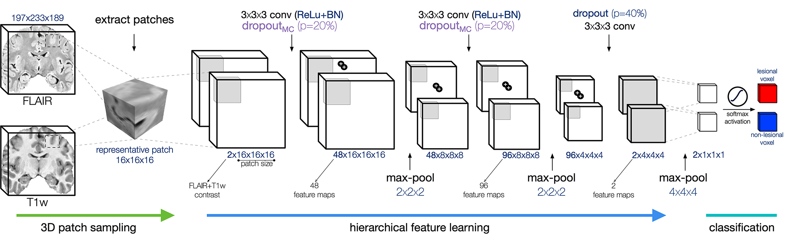

<h2 align="center">
  Code repository for:<br>
  Multicenter Validated Detection of Focal Cortical Dysplasia using Deep Learning<br>
</h2>

<p align="center">
      <a href="https://www.python.org/">
        </a>
      <a href= "https://keras.io/">
        </a>
      <a href= "https://github.com/Theano/Theano">
        </a>
      <a href="https://bids.neuroimaging.io/">
        </a>
      <a href= "https://github.com/NOEL-MNI/deepFCD/blob/main/LICENSE">
        </a>
      <a href="https://doi.org/10.1212/WNL.0000000000012698">
        </a>
</p>

------------------------



## About

deepFCD is an automated deep learning tool for detecting focal cortical dysplasia (FCD) in structural MRI. The system uses a cascade of dual convolutional neural networks trained on multicenter data to identify FCD lesions that are often challenging to detect visually.

### Key Features
- **BIDS-compliant**: Native support for BIDS datasets
- **Dual CNN architecture**: Two-stage detection for improved accuracy
- **Automatic preprocessing**: Brain extraction, registration, bias correction
- **Uncertainty estimation**: Provides confidence metrics with predictions
- **Multicenter validated**: Tested across multiple clinical sites

### Please cite:
> Gill, R. S., Lee, H. M., Caldairou, B., Hong, S. J., Barba, C., Deleo, F., D'Incerti, L., Mendes Coelho, V. C., Lenge, M., Semmelroch, M., Schrader, D. V., Bartolomei, F., Guye, M., Schulze-Bonhage, A., Urbach, H., Cho, K. H., Cendes, F., Guerrini, R., Jackson, G., Hogan, R. E., … Bernasconi, A. (2021). Multicenter Validation of a Deep Learning Detection Algorithm for Focal Cortical Dysplasia. Neurology, 97(16), e1571–e1582. https://doi.org/10.1212/WNL.0000000000012698

## Requirements

> **⚠️ Important:** Native installation is only supported with CUDA ≤ 12.2 due to Keras/Theano limitations. **For CUDA > 12.2, please use Docker** (recommended for all users).

### System Requirements
- **OS**: Linux (tested on Ubuntu 20.04+)
- **GPU**: NVIDIA GPU with CUDA support (optional but recommended)
  - For Docker: Any CUDA version supported by nvidia-container-toolkit
  - For native installation: **CUDA ≤ 12.2 required**
- **Memory**: 16GB RAM minimum, 32GB+ recommended
- **Storage**: 10GB+ for software, variable for data

### Software Dependencies
- Python 3.8
- Keras 2.2.4
- Theano 1.0.4
- ANTsPy 0.4.2 (for preprocessing)
- ANTsPyNet 0.2.3 (for deepMask brain extraction)
- PyTorch 1.8.2 LTS (for deepMask)
- h5py 2.10.0
- pygpu 0.7.6
- pybids (for BIDS dataset handling)
- See `app/requirements.txt` and `app/deepMask/app/requirements.txt` for complete list

### BIDS Compliance
deepFCD expects and produces BIDS-compliant datasets (BIDS v1.10.0).

## Installation

### Option 1: Docker (Recommended)

Docker is the recommended installation method as it provides a consistent environment with all dependencies pre-configured.

#### Prerequisites
- [Docker](https://docs.docker.com/get-docker/) installed
- [nvidia-container-toolkit](https://docs.nvidia.com/datacenter/cloud-native/container-toolkit/install-guide.html) for GPU support

#### Pull the Docker Image
```bash
docker pull noelmni/deep-fcd:bids-dev
```

See the [Usage](#usage) section below for Docker-based inference examples.

### Option 2: Conda (Native Installation)

**Note:** Native installation requires CUDA ≤ 12.2 due to Keras/Theano compatibility limitations. For newer CUDA versions, please use Docker.

#### Prerequisites
- CUDA Toolkit ≤ 12.2 (if using GPU)
- cuDNN compatible with your CUDA version

#### Installation Steps

```bash
# Clone the repo with the deepMask submodule
git clone --recurse-submodules -j2 https://github.com/NOEL-MNI/deepFCD.git
cd deepFCD

# Install Miniforge (recommended) or Miniconda
wget https://github.com/conda-forge/miniforge/releases/download/25.3.1-0/Miniforge3-25.3.1-0-Linux-x86_64.sh
bash Miniforge3-25.3.1-0-Linux-x86_64.sh -b -p $HOME/conda
export PATH=$HOME/conda/bin:$PATH

# Create and activate a Conda environment for deepFCD
conda create -n deepFCD -c conda-forge python=3.8.20 pygpu==0.7.6
conda activate deepFCD

# Install dependencies
python -m pip install -r app/requirements.txt
python -m pip install -r app/deepMask/app/requirements.txt
```

#### Alternative: Environment File

```bash
# Clone the repository
git clone --recurse-submodules -j2 https://github.com/NOEL-MNI/deepFCD.git
cd deepFCD

# Create environment from YAML
conda env create -f environment.yml
conda activate deepFCD

# Install additional dependencies
pip install -r app/requirements.txt
pip install -r app/deepMask/app/requirements.txt
```

#### Verify Installation

```bash
# Check that the environment is set up correctly
conda activate deepFCD
python -c "import keras; import theano; import ants; print('Installation successful!')"
```

#### CUDA Compatibility Warning
If you have CUDA > 12.2, Theano/Keras may not work properly. In this case, please use the Docker installation method instead.

## BIDS Structure

### Input Dataset
deepFCD expects a BIDS-compliant neuroimaging dataset with T1w and FLAIR images:

```
bids_root/
├── dataset_description.json
├── sub-<subject>/
│   ├── [ses-<session>/]
│   │   └── anat/
│   │       ├── sub-<subject>[_ses-<session>]_T1w.nii.gz
│   │       ├── sub-<subject>[_ses-<session>]_T1w.json
│   │       ├── sub-<subject>[_ses-<session>]_FLAIR.nii.gz
│   │       └── sub-<subject>[_ses-<session>]_FLAIR.json
```

### Output Derivatives
deepFCD creates two derivative datasets following BIDS conventions:

#### 1. Preprocessing Derivatives (`deepFCD-preproc`)
```
bids_root/derivatives/deepFCD-preproc/
├── dataset_description.json
├── sub-<subject>/
│   ├── [ses-<session>/]
│   │   ├── anat/
│   │   │   ├── sub-<subject>[_ses-<session>]_space-MNI152_T1w_brain.nii.gz
│   │   │   └── sub-<subject>[_ses-<session>]_space-MNI152_FLAIR_brain.nii.gz
│   │   └── xfm/
│   │       ├── sub-<subject>[_ses-<session>]_from-T1w_to-MNI152_mode-image_xfm.mat
│   │       └── sub-<subject>[_ses-<session>]_from-FLAIR_to-MNI152_mode-image_xfm.mat
```

#### 2. Inference Derivatives (`deepFCD`)
```
bids_root/derivatives/deepFCD/
├── dataset_description.json
├── sub-<subject>/
│   ├── [ses-<session>/]
│   │   └── anat/
│   │       ├── # MNI152 space outputs
│   │       ├── sub-<subject>[_ses-<session>]_space-MNI152_desc-deepFCD_stat-mean0_probseg.nii.gz
│   │       ├── sub-<subject>[_ses-<session>]_space-MNI152_desc-deepFCD_stat-var0_probseg.nii.gz
│   │       ├── sub-<subject>[_ses-<session>]_space-MNI152_desc-deepFCD_stat-mean1_probseg.nii.gz
│   │       ├── sub-<subject>[_ses-<session>]_space-MNI152_desc-deepFCD_stat-var1_probseg.nii.gz
│   │       ├── # Original/native space outputs (transformed back)
│   │       ├── sub-<subject>[_ses-<session>]_space-orig_desc-deepFCD_stat-mean0_probseg.nii.gz
│   │       ├── sub-<subject>[_ses-<session>]_space-orig_desc-deepFCD_stat-var0_probseg.nii.gz
│   │       ├── sub-<subject>[_ses-<session>]_space-orig_desc-deepFCD_stat-mean1_probseg.nii.gz
│   │       └── sub-<subject>[_ses-<session>]_space-orig_desc-deepFCD_stat-var1_probseg.nii.gz
```

**Output files explained:**
- `stat-mean0`: Mean probability from CNN-1
- `stat-var0`: Uncertainty/variance from CNN-1  
- `stat-mean1`: Mean probability from CNN-2 (final output)
- `stat-var1`: Uncertainty/variance from CNN-2 (final output)
- `space-MNI152`: Standard MNI space
- `space-orig`: Original/native acquisition space

See [docs/bids_derivatives_structure.md](docs/bids_derivatives_structure.md) for complete details.

## Usage

### Docker-Based Inference (Recommended)

The recommended way to use deepFCD is with Docker and BIDS-structured datasets.

#### Basic Usage with GPU (automatic preprocessing)
```bash
docker run --rm -it --init \
    --gpus=all \
    --user="$(id -u):$(id -g)" \
    --volume="/path/to/bids_root:/data" \
    noelmni/deep-fcd:bids-dev \
    python /app/inference_bids.py \
        --bidspath /data \
        --space MNI152NLin2009aSym \
        --device cuda0 \
        --preprocess \
        --brainmask
```

#### With pre-processed files (skip preprocessing)
```bash
docker run --rm -it --init \
    --gpus=all \
    --user="$(id -u):$(id -g)" \
    --volume="/path/to/bids_root:/data" \
    noelmni/deep-fcd:bids-dev \
    python /app/inference_bids.py \
        --bidspath /data \
        --space MNI152NLin2009aSym \
        --device cuda0
```

#### Process specific subjects/sessions
```bash
docker run --rm -it --init \
    --gpus=all \
    --user="$(id -u):$(id -g)" \
    --volume="/path/to/bids_root:/data" \
    noelmni/deep-fcd:bids-dev \
    python /app/inference_bids.py \
        --bidspath /data \
        --space MNI152NLin2009aSym \
        --device cuda0 \
        --subjects sub-001 sub-002_ses-01 sub-003
```

#### CPU-only mode
```bash
docker run --rm -it --init \
    --user="$(id -u):$(id -g)" \
    --volume="/path/to/bids_root:/data" \
    --env OMP_NUM_THREADS=8 \
    noelmni/deep-fcd:bids-dev \
    python /app/inference_bids.py \
        --bidspath /data \
        --space MNI152NLin2009aSym \
        --device cpu \
        --preprocess \
        --brainmask
```

**Docker command explanation:**
- `--gpus=all`: Expose all GPUs to the container (requires nvidia-container-toolkit)
- `--user="$(id -u):$(id -g)"`: Run as current user to avoid permission issues
- `--volume="/path/to/bids_root:/data"`: Mount your BIDS dataset (change `/path/to/bids_root` to your actual path)
- `--env OMP_NUM_THREADS=8`: Set number of CPU threads (CPU mode only)

### Native Python Inference

**Note:** Requires CUDA ≤ 12.2. For newer CUDA versions, use Docker.

#### Basic Usage (with automatic preprocessing)
```bash
conda activate deepFCD
python app/inference_bids.py \
    --bidspath /path/to/bids_root \
    --space MNI152NLin2009aSym \
    --device cuda0 \
    --preprocess \
    --brainmask
```

#### With pre-processed files (skip preprocessing)
```bash
python app/inference_bids.py \
    --bidspath /path/to/bids_root \
    --space MNI152NLin2009aSym \
    --device cuda0
```

#### Process specific subjects/sessions
```bash
python app/inference_bids.py \
    --bidspath /path/to/bids_root \
    --space MNI152NLin2009aSym \
    --device cuda0 \
    --subjects sub-001 sub-002_ses-01 sub-003
```

### Command-Line Arguments

| Argument | Short | Description | Default |
|----------|-------|-------------|---------|
| `--bidspath` | `-bp` | Path to BIDS dataset root | **Required** |
| `--outpath` | `-op` | Output path | `<bids_root>/derivatives/deepFCD` |
| `--space` | `-sp` | Target space template | `MNI152NLin2009aSym` |
| `--brainmask` | `-bm` | Enable brain extraction | `False` |
| `--preprocess` | `-pp` | Enable preprocessing (registration + bias correction) | `False` |
| `--overwrite` | `-o` | Overwrite existing predictions | `False` |
| `--overwrite-pp` | | Overwrite existing preprocessing outputs | `False` |
| `--device` | `-dev` | Device to use: `cpu` or `cuda0` | `cpu` |
| `--subjects` | `-s` | List of subjects/sessions to process | All subjects |
| `--debug` | | Enable debug logging | `False` |

### Examples

#### Example 1: Docker - Process all subjects with automatic preprocessing (GPU)
```bash
docker run --rm -it --init \
    --gpus=all \
    --user="$(id -u):$(id -g)" \
    --volume="/data/my_study:/data" \
    noelmni/deep-fcd:bids-dev \
    python /app/inference_bids.py \
        --bidspath /data \
        --space MNI152NLin2009aSym \
        --device cuda0 \
        --preprocess \
        --brainmask
```

This will:
1. Process all subjects in the BIDS dataset
2. Perform brain extraction using deepMask
3. Apply N3 bias correction
4. Register to MNI152 space
5. Run FCD detection inference
6. Save outputs to `/data/my_study/derivatives/deepFCD/`

#### Example 2: Docker - Process specific subjects without preprocessing
```bash
docker run --rm -it --init \
    --gpus=all \
    --user="$(id -u):$(id -g)" \
    --volume="/data/my_study:/data" \
    noelmni/deep-fcd:bids-dev \
    python /app/inference_bids.py \
        --bidspath /data \
        --space MNI152NLin2009aSym \
        --device cuda0 \
        --subjects sub-001 sub-002 sub-003_ses-baseline
```

This processes only the specified subjects using existing preprocessed files.

#### Example 3: Docker - Overwrite existing outputs
```bash
docker run --rm -it --init \
    --gpus=all \
    --user="$(id -u):$(id -g)" \
    --volume="/data/my_study:/data" \
    noelmni/deep-fcd:bids-dev \
    python /app/inference_bids.py \
        --bidspath /data \
        --device cuda0 \
        --overwrite \
        --overwrite-pp
```

This re-runs both preprocessing and inference even if outputs exist.

#### Example 4: Native Python - Process with GPU (CUDA ≤ 12.2 only)
```bash
conda activate deepFCD
python app/inference_bids.py \
    --bidspath /data/my_study \
    --space MNI152NLin2009aSym \
    --device cuda0 \
    --preprocess \
    --brainmask
```

**Note:** Only use native installation if you have CUDA ≤ 12.2. Otherwise, use Docker.

## Documentation

Comprehensive documentation is available in the `docs/` directory:

- **[Input Requirements](docs/input_requirements.md)** - BIDS input specifications, file formats, and preprocessing requirements
- **[BIDS Derivatives Structure](docs/bids_derivatives_structure.md)** - Output directory structure and file naming conventions
- **[Dynamic Metadata Generation](docs/dynamic_metadata_generation.md)** - BIDS metadata JSON sidecar generation
- **[Reporting](docs/reporting.md)** - Output visualization and interpretation

## Troubleshooting

### Missing preprocessed files
If you see errors about missing `*_space-MNI152_*_brain.nii.gz` files:
1. Ensure you have raw T1w and FLAIR images in your BIDS dataset
2. Run with `-pp` and `-bm` flags to enable preprocessing
3. Check that both modalities exist for each subject

### GPU out of memory
If you encounter GPU memory errors:
1. Monitor GPU memory with `nvidia-smi`
2. Process subjects in smaller batches
3. Consider using CPU if GPU memory is insufficient

## Citation

If you use deepFCD in your research, please cite our paper:

```bibtex
@article{GillFCD2021,
  title = {Multicenter Validated Detection of Focal Cortical Dysplasia using Deep Learning},
  author = {Gill, Ravnoor Singh and Lee, Hyo-Min and Caldairou, Benoit and Hong, Seok-Jun and Barba, Carmen and Deleo, Francesco and D'Incerti, Ludovico and Coelho, Vanessa Cristina Mendes and Lenge, Matteo and Semmelroch, Mira and others},
  journal = {Neurology},
  volume = {97},
  number = {16},
  pages = {e1571--e1582},
  year = {2021},
  publisher = {American Academy of Neurology},
  doi = {10.1212/WNL.0000000000012698}
}
```

## Contributing

Contributions are welcome! Please feel free to submit issues or pull requests.

## Support

For questions or issues:
1. Check the [documentation](docs/)
2. Search existing [GitHub issues](https://github.com/NOEL-MNI/deepFCD/issues)
3. Open a new issue with:
   - Your command
   - Error messages
   - System information (OS, GPU, CUDA version)
   - BIDS dataset structure

## License

This project is licensed under the BSD 3-Clause License - see the [LICENSE](LICENSE) file for details.

```
Copyright 2021-2025 Neuroimaging of Epilepsy Laboratory, McGill University
```

## Acknowledgments

This work was conducted at the Neuroimaging of Epilepsy Laboratory (NOEL) at the Montreal Neurological Institute, McGill University. We thank all clinical collaborators and research participants who contributed to this multicenter study.

